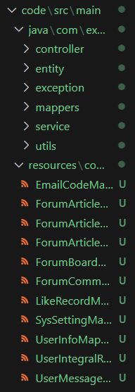

<!--
 * @Description:
 * @FilePath: \README.md
 * @Author: Aloof rongquanhuang01@gmail.com
 * @Date: 2023-11-01 10:24:05
 * @LastEditors: WhimsyQuester rongquanhuang01@gmail.com
 * @LastEditTime: 2023-11-15 15:40:19
 * Copyright (c) 2023 by Aloof , All Rights Reserved.
-->

# 1.介绍

&emsp;&emsp;在项目开发过程中，有很多业务模块的代码是具有一定规律性的，例如 controller 控制器、service 接口、service 实现类、mapper 接口、model 实体类等等，这部分代码可以使用代码生成器生成，我们就可以将更多的时间放在业务逻辑上。

```bash
传统的开发步骤：
(1)创建数据库和表
(2)根据表设计实体类
(3)编写 entity 实体类
(4)编写 mapper 接口
(5)编写 service 接口和实现类
(6)编写 controller 控制器

基于代码生成器开发步骤：
(1)创建数据库和表
(2)使用代码生成器生成entity实体类、mapper接口、service接口和实现类、controller 控制器
(3)将生成好的代码拷贝到项目中并做调整
```

&emsp;&emsp;我们只需要知道数据库和表相关信息，就可以结合模版生成各个模块的代码，减少了很多重复工作，也减少出错概率，提高开发效率。

# 2.实现思路


```bash
(1)需要对数据库表解析获取到元数据，包含表字段名称、字段类型等等。
(2)将通用的代码编写成模版文件，部分数据需使用占位符替换。
(3)将元数据和模版文件结合生成源代码文件。
```

生成的代码结构如下

```bash
src
└───main
    ├───java
    │   └───com
    │       └───example
    │           └───demo
    │               ├───controller      控制器类
    │               ├───entity          实体类
    │               │   ├───enums       枚举类型
    │               │   ├───po          持久化对象
    │               │   ├───query       查询对象或查询相关类
    │               │   └───vo          值对象
    │               ├───exception       自定义异常类
    │               ├───mappers         映射器
    │               ├───service         业务逻辑实现类
    │               │   └───impl        服务实现类
    │               └───utils           工具类
    └───resources                       资源目录
        └───com
            └───example
                └───demo
                    └───mappers         数据库映射文件
```

# 3.项目结构

```bash
generator                                   代码生成工具
├───src
│   ├───main
│   │   ├───java
│   │   │   └───org
│   │   │       └───example
│   │   │           ├───bean                常量值类
│   │   │           ├───builder             构建方法
│   │   │           └───utils               工具类
│   │   └───resources                       资源目录
│   │       └───template                    模板文件
│   └───test
│       └───java
└───target                                  编译目标类
    ├───classes
    │   ├───org
    │   │   └───example
    │   │       ├───bean
    │   │       ├───builder
    │   │       └───utils
    │   └───template
    ├───generated-sources
    │   └───annotations
    └───test-classes

```

# 4.使用方法

(1) 在项目的[application.properties](generator\src\main\resources\application.properties)下配置数据库的 URL、用户名和密码，还可以根据需要调整包名和后缀定义以及其它设置


(2) 运行[GeneratorApplication.java](generator\src\main\java\org\example\utils)程序,生成代码


生成的代码文件保存在[code](./code/)目录下


